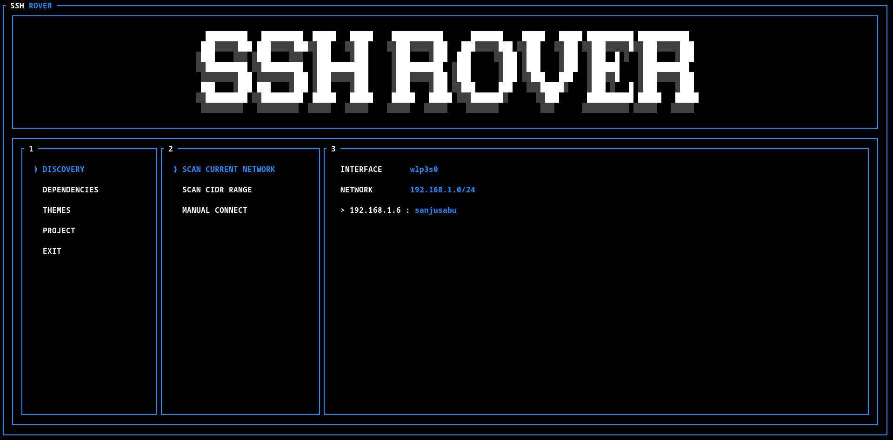
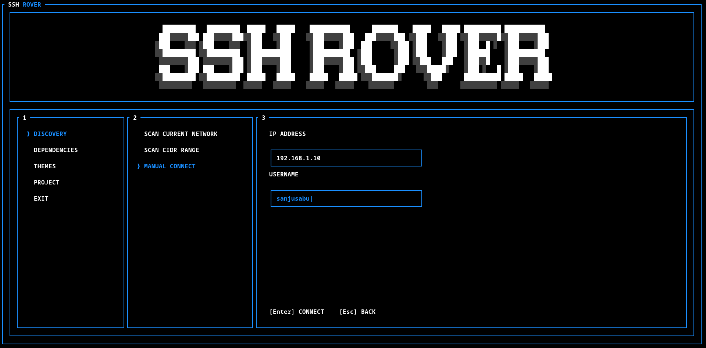

# SSH Rover

A terminal application for discovering hosts on a local network and connecting to them over SSH.

## Scan Current Network



## Manual Connect



## Features

- Discover hosts on your local network
- Scan custom IPv4 CIDR ranges
- Connect to a single host over SSH
- Shows the correct install command for Nmap and OpenSSH based on your Linux distro
- multiple color themes

## Requirements

- OpenSSH
- Nmap

## Installation

```bash
cargo install ssh-rover
```

## Usage

```bash
ssh-rover
```

## License

GPL-3

